# AWS SAA Graduation Project: Serverless Image Processing Pipeline

This repository implements **Project 2: Serverless Image Processing Pipeline with S3, SQS, and Lambda** from the AWS Solutions Architect - Associate graduation project ideas.

The goal is a submission-ready GitHub repository with a clear architecture diagram, infrastructure as code, Lambda application code, tests, deployment instructions, demo steps, cleanup steps, and a direct checklist against the project criteria.

## Architecture

```mermaid
flowchart LR
    User["User or frontend"] -->|"POST /uploads"| Api["API Gateway HTTP API"]
    Api --> UploadLambda["Lambda: pre-signed upload URL"]
    UploadLambda -->|"PutItem: PENDING"| Metadata["DynamoDB image metadata"]
    UploadLambda -->|"Create pre-signed PUT URL"| SourceBucket["S3 source bucket"]
    User -->|"PUT original image"| SourceBucket
    SourceBucket -->|"ObjectCreated event"| Queue["SQS image event queue"]
    Queue --> StarterLambda["Lambda: workflow starter"]
    StarterLambda --> Workflow["Step Functions workflow"]
    Workflow -->|"Update: PROCESSING"| Metadata
    Workflow --> ProcessorLambda["Lambda: resize and watermark"]
    ProcessorLambda -->|"Get original"| SourceBucket
    ProcessorLambda -->|"Put thumbnail and display image"| ProcessedBucket["S3 processed bucket"]
    Workflow -->|"Update: PROCESSED or FAILED"| Metadata
    Workflow --> Notifications["SNS notifications"]
    ProcessedBucket -->|"Private origin access"| CloudFront["CloudFront distribution"]
    CloudFront -->|"HTTPS processed images"| User
    Queue -->|"After retries"| DLQ["SQS dead-letter queue"]
```



The same diagram source is stored in [diagrams/architecture.mmd](diagrams/architecture.mmd).

## What This Builds

- **S3 source bucket** for original image uploads.
- **S3 processed bucket** for thumbnail and display-size JPEG outputs.
- **API Gateway HTTP API** with `POST /uploads` for pre-signed upload URL generation.
- **Lambda upload handler** that validates the request, creates a DynamoDB metadata record, and returns a pre-signed S3 URL.
- **SQS queue and dead-letter queue** that decouple S3 upload events from processing.
- **Lambda workflow starter** that starts a Step Functions execution for each uploaded image.
- **Step Functions workflow** for `PENDING -> PROCESSING -> PROCESSED` or `FAILED`.
- **Lambda image processor** using Pillow to resize and watermark images.
- **DynamoDB metadata table** for image job status and output locations.
- **CloudFront distribution** for global delivery of processed images from a private S3 origin.
- **SNS topic** for success and failure notifications.
- **CloudWatch logs** for API Gateway, Lambda, and Step Functions.
- **IAM roles and least-privilege policies** for each compute component.
- **Encryption and lifecycle controls** on S3, SQS, SNS, and DynamoDB where supported.

## Public Interface

### `POST /uploads`

Request:

```json
{
  "filename": "sample.jpg",
  "contentType": "image/jpeg"
}
```

Supported content types:

- `image/jpeg` with `.jpg` or `.jpeg`
- `image/png` with `.png`

Response:

```json
{
  "imageId": "uuid",
  "objectKey": "uploads/uuid/sample.jpg",
  "uploadUrl": "https://...",
  "expiresIn": 900
}
```

Upload the file with:

```bash
curl --request PUT \
  --header "Content-Type: image/jpeg" \
  --upload-file sample.jpg \
  "$UPLOAD_URL"
```

## Repository Structure

```text
.
+-- *.tf                         # Terraform infrastructure
+-- lambda_src/
|   +-- common/                  # Shared status, validation, key, and image helpers
|   +-- upload_url/              # API Gateway Lambda handler
|   +-- workflow_starter/        # SQS to Step Functions Lambda handler
|   +-- processor/               # Pillow-based resize and watermark Lambda handler
+-- tests/                       # Local unit tests for core Lambda behavior
+-- scripts/package_lambdas.sh   # Reproducible Lambda zip build
+-- diagrams/architecture.mmd    # Mermaid architecture diagram source
+-- terraform.tfvars.example     # Example deployment variables
```

## Deployment Steps

Prerequisites:

- AWS CLI configured with an account that can create the listed services.
- Terraform `>= 1.5`.
- Python 3.12 or compatible Python 3 with `pip`.
- `zip` command available locally.

1. Copy the example variables:

```bash
cp terraform.tfvars.example terraform.tfvars
```

2. Edit `terraform.tfvars`:

```hcl
project_name       = "saa-image-pipeline"
aws_region         = "us-east-1"
environment        = "dev"
notification_email = "your-email@example.com"
watermark_text     = "SAA Demo"
thumbnail_max_px   = 320
display_max_px     = 1280
```

3. Package the Lambda code:

```bash
make package
```

This creates `build/lambda-package.zip`, which Terraform uploads to all Lambda functions.

4. Initialize and validate Terraform:

```bash
terraform init
terraform fmt -recursive -check
terraform validate
```

5. Deploy:

```bash
terraform plan -out tfplan
terraform apply tfplan
```

6. If `notification_email` is set, confirm the SNS subscription from the email AWS sends.

## Demo Flow

1. Read the API endpoint:

```bash
terraform output -raw api_gateway_url
```

2. Request a pre-signed upload URL:

```bash
API_URL="$(terraform output -raw api_gateway_url)"

curl --request POST "$API_URL/uploads" \
  --header "Content-Type: application/json" \
  --data '{"filename":"sample.jpg","contentType":"image/jpeg"}'
```

3. Save the `uploadUrl` and upload an image:

```bash
curl --request PUT \
  --header "Content-Type: image/jpeg" \
  --upload-file sample.jpg \
  "$UPLOAD_URL"
```

4. Confirm processing:

- DynamoDB item moves from `PENDING` to `PROCESSING` to `PROCESSED`.
- Step Functions execution succeeds.
- Processed images appear under `processed/<imageId>/`.
- SNS sends a completion notification.

5. View the processed display image:

```bash
CLOUDFRONT_DOMAIN="$(terraform output -raw cloudfront_domain_name)"
open "https://$CLOUDFRONT_DOMAIN/processed/$IMAGE_ID/display.jpg"
```

## Failure Handling

- Invalid API requests return `400` before any S3 upload occurs.
- Failed SQS processing retries automatically.
- Messages that fail repeatedly move to the SQS dead-letter queue.
- Image processing exceptions are caught by Step Functions.
- Failed jobs are written to DynamoDB with status `FAILED`.
- SNS sends a failure notification.

## Security Design

- Original and processed buckets block public access.
- CloudFront uses Origin Access Control to read processed images from the private S3 bucket.
- S3 buckets use server-side encryption.
- SQS uses managed server-side encryption.
- DynamoDB uses server-side encryption and point-in-time recovery.
- SNS uses the AWS-managed SNS KMS key.
- Lambda roles are split by responsibility:
  - Upload URL Lambda can write metadata and pre-sign source uploads.
  - Workflow starter Lambda can start the state machine.
  - Processor Lambda can read source images and write processed images.
  - Step Functions can update DynamoDB, invoke the processor, and publish SNS notifications.
- No EC2 bastion hosts or long-lived server access are required.

## Cost Notes

This design uses mostly pay-per-use serverless services. Expected demo costs are low when traffic is small, but costs can come from S3 storage, CloudFront requests, Lambda duration, Step Functions state transitions, DynamoDB requests, SQS requests, SNS notifications, and API Gateway requests.

To reduce cost:

- Keep test images small.
- Destroy the stack after the demo.
- Leave `notification_email` blank if email notifications are not needed.
- Review CloudFront and S3 usage if the processed image URL is shared publicly.

## Cleanup

Before destroying, empty both S3 buckets if they contain objects:

```bash
aws s3 rm "s3://$(terraform output -raw source_bucket_name)" --recursive
aws s3 rm "s3://$(terraform output -raw processed_bucket_name)" --recursive
```

Then destroy:

```bash
terraform destroy
```

## Local Tests

Install local Python dependencies if your environment does not already have Pillow:

```bash
python3 -m pip install -r lambda_src/requirements.txt
```

Run:

```bash
make test
```

The tests cover:

- Supported status lifecycle: `PENDING`, `PROCESSING`, `PROCESSED`, `FAILED`.
- Valid JPG/PNG upload validation.
- Invalid content type rejection.
- Mismatched extension rejection.
- S3 key generation and image ID extraction.
- SQS-wrapped S3 event parsing.
- Pillow-based resize and watermark output generation.
- Corrupt image rejection.

## Criteria Checklist

| Graduation criterion | How this repo satisfies it |
| --- | --- |
| Solution architecture diagram | Mermaid diagram embedded in this README and stored in `diagrams/architecture.mmd`. |
| GitHub repository with documentation | README includes architecture, services, deployment, demo, tests, cleanup, security, cost, and learning outcomes. |
| Complete project documentation | Terraform variables, outputs, public API, repository structure, and operational flow are documented. |
| Optional live URL or video | Deployment and demo steps are included so a live AWS demo or recorded walkthrough can be produced. |
| S3 source and destination buckets | Implemented in `s3.tf`. |
| SQS and DLQ decoupling | Implemented in `sqs.tf`. |
| Lambda image processing | Implemented in `lambda_src/processor/app.py` using Pillow helpers. |
| Step Functions orchestration | Implemented in `stepfunctions.tf`. |
| API Gateway pre-signed URL endpoint | Implemented in `api_gateway.tf` and `lambda_src/upload_url/app.py`. |
| DynamoDB metadata store | Implemented in `dynamodb.tf`. |
| CloudFront delivery | Implemented in `cloudfront.tf`. |
| SNS notifications | Implemented in `sns.tf` and the Step Functions workflow. |

## Learning Outcomes Mapping

- **Event-driven architecture:** S3 events are delivered to SQS, then consumed by Lambda.
- **Resilience and retries:** SQS decouples uploads from processing and uses a DLQ for repeated failures.
- **Lambda dependencies:** Pillow is packaged into the Lambda artifact by `scripts/package_lambdas.sh`.
- **Workflow orchestration:** Step Functions controls processing, metadata updates, and notifications.
- **Lifecycle policies:** S3 lifecycle rules expire original uploads and transition processed images.
- **Global content delivery:** CloudFront serves processed images through an HTTPS edge distribution.
